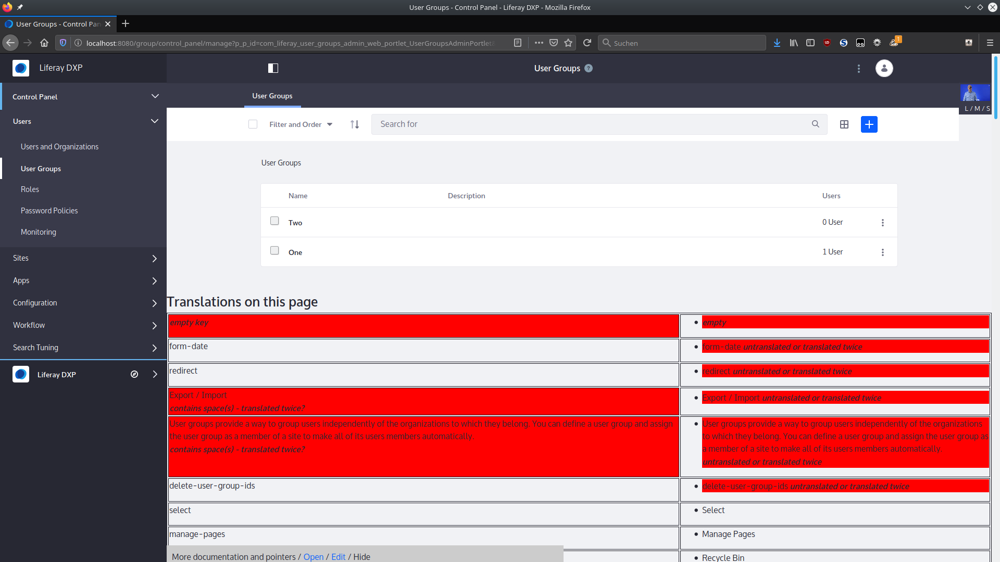

# translation-helper-web

Translating Software is hard. And for a complex software like Liferay, it's even harder, because when you spot a missing (or inaccurate) translation, you'll need to find localization keys that need correction. And they're not easy to spot. 

This plugin for Liferay 7.3 follows an ancient idea from the 6.1 times [documented in the forums](https://liferay.dev/forums/-/message_boards/view_message/9705908#_com_liferay_message_boards_web_portlet_MBPortlet_message_9705908) and just keeps track of everything that has been looked up during a request, then tacks it to the end of the page, currently as HTML table _and_ as a JS Map, so that a more sophisticated application can be written on top of it.

## how to use

Clone this repository into a Liferay Workspace (tested with `liferay.workspace.product=dxp-7.3-ga1`) and build it.

When deployed to your running server, the default configuration makes the translations available to signed-in Administrators. You can change the configuration in Control Panel / Configuration / System Settings / Localization / Translation Helper.

(former version was created for version 7.2)

## how does it look like?

